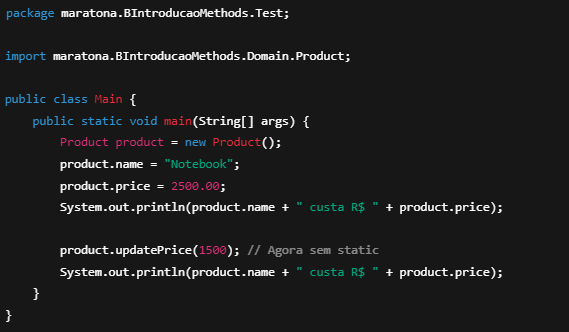

### *Resumo do Aprendizado*

#### *Estruturas de Repeticao*

-for é mais utilizado para contar, enquanto o while é mais utilizado para repetir.

-O break é utilizado para sair de um laço quando uma condição específica é atendida, 
enquanto o continue permite pular a iteração atual e continuar com a próxima.

#### *Arrays*
Foreach é uma estrutura de repetição que percorre todos os elementos de um array, 
portanto nao é possivel pegar um indice especifico

#### *Orientação Objetos - Métodos*
Parametro tipo reference: é passado por referencia, ou seja, se o valor for alterado dentro do metodo,
o valor da variavel fora do metodo tambem sera alterado.

#### *Orientação Objetos - Modificadores de Acesso*

Sobrecarga de metodos: é possivel criar metodos com o mesmo nome, mas com parametros diferentes.

