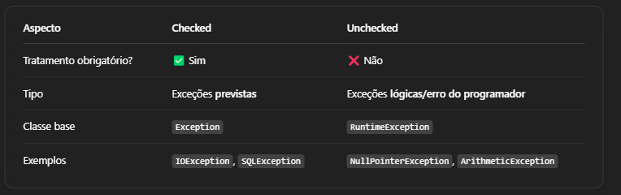

### *Resumo do Aprendizado*

#### *Estruturas de Repeticao*

-for é mais utilizado para contar, enquanto o while é mais utilizado para repetir.

-O break é utilizado para sair de um laço quando uma condição específica é atendida, 
enquanto o continue permite pular a iteração atual e continuar com a próxima.

#### *Arrays*
Foreach é uma estrutura de repetição que percorre todos os elementos de um array, 
portanto nao é possivel pegar um indice especifico

#### *Orientação Objetos - Métodos*
Parametro tipo reference: é passado por referencia, ou seja, se o valor for alterado dentro do metodo,
o valor da variavel fora do metodo tambem sera alterado.

#### *Orientação Objetos - Modificadores de Acesso*

Sobrecarga de metodos: é possivel criar metodos com o mesmo nome, mas com parametros diferentes.
O static faz o atributo pertece a classe, e todos os objetos criados a partir dela terao o mesmo valor.
normalmente é utilizado quando nao é necessario criar um objeto para acessar o atributo.

#### *Associação*

#### *Heranca*
    // 0 - Bloco de inicialização estaticoda super classe é executado quando a JVM carregar a classe pai
    // 1 - Bloco de inicialização estaticoda subclasse é executado quando a JVM carregar a classe filha
    // 2 - Alocado espaço na memória para o objeto da superclasse
    // 3 - Cada atributo de superclasse é criado e inicializado com seus valores default ou o que for passado
    // 4 - Bloco de inicialização da superclasse é executado na ordem em que aparece
    // 5 - Construtor da superclasse é executado
    // 6 - Alocado espaço na memória para o objeto da subclasse
    // 7 - Cada atributo de subclasse é criado e inicializado com seus valores default ou o que for passado
    // 8 - Bloco de inicialização da subclasse é executado na ordem em que aparece
    // 5 - Construtor da subclasse é executado

#### *Exceções*

